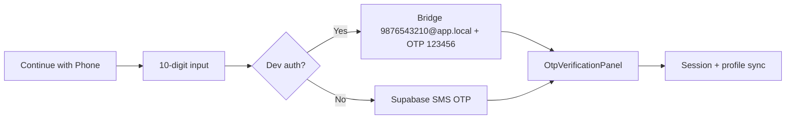
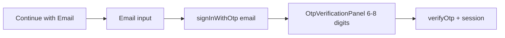

# Hybrid OTP Authentication Architecture

Production-ready Supabase Auth: **phone OTP** + **email OTP**, preserving existing users, gyms, memberships, and attendance.

## Folder structure

```
src/services/auth/
  auth.constants.ts      # OTP timers, bridge domains, error codes
  auth.types.ts          # TypeScript contracts
  auth.utils.ts          # Bridge email, provider detection, errors
  auth.validators.ts     # Zod schemas (phone, email, OTP)
  auth.service.ts        # Public facade
  hybrid-auth.service.ts # Phone + email OTP API
  session.service.ts     # Session bootstrap, refresh, signOut
  otp.service.ts         # Client OTP session (expiry, cooldown, attempts)
  providers/
    phone.provider.ts    # SMS OTP + dev pseudo-email bridge
    email.provider.ts    # Supabase email OTP (always real)
  dev-otp.ts             # Dev-only phone bridge (@app.local)

src/hooks/
  useAuthSession.ts      # Root layout: Supabase → Zustand
  useSession.ts          # Read session
  useAuth.ts             # Session + signOut + method detection
  useOTP.ts              # Resend cooldown + expiry countdown
  usePhoneAuth.ts        # Phone send / verify / resend
  useEmailAuth.ts        # Email send / verify / resend
  useHybridAuth.ts       # UI step state (method → input → otp)
  useRole.ts             # Owner/member context

src/components/auth/
  AuthMethodPicker.tsx   # Continue with Phone / Email
  AuthStatusMessage.tsx
  PhoneAuthForm.tsx
  EmailAuthForm.tsx
  OtpInput.tsx           # Auto-focus digit boxes
  OtpVerificationPanel.tsx

src/screens/auth/
  HybridAuthScreen.tsx   # Unified auth landing + flows
  ForgotPasswordScreen.tsx
```

## Flows

### Phone (preserved)



- **Production:** `signInWithOtp({ phone })` → SMS
- **Dev:** Internal pseudo email `9876543210@app.local` (legacy `gymos.app` still works at login)
- Pseudo emails **never** shown in UI

### Email (OTP-only)



- Always real Supabase email OTP (no hardcoded code)
- Template must include `{{ .Token }}` in Supabase dashboard

## OTP client safeguards (`otp.service.ts`)

| Rule | Value |
|------|-------|
| Expiry | 10 minutes |
| Resend cooldown | 60 seconds |
| Max verify attempts | 5 |
| Max resends | 5 |

## Database

Migration: `supabase/migrations/20260528140000_hybrid_auth_profile_fields.sql`

- `email`, `auth_provider`, `auth_type`, `email_verified`, `phone_verified`, `provider_metadata`
- Non-destructive backfill for `@app.local` / `@gymos.app` bridge users
- All FKs unchanged (`profiles.id` → gyms, memberships, attendance)

## Session

```
AsyncStorage ← Supabase (persistSession, autoRefreshToken)
       ↓
useAuthSession → useAuthStore (Zustand)
       ↓
useAuth / useSession / ProtectedRoute
```

## Supabase checklist

1. Email provider enabled; template shows `{{ .Token }}`
2. Phone provider + SMS configured
3. Custom SMTP recommended
4. `EXPO_PUBLIC_ENABLE_DEV_AUTH=false` for real email OTP

## Future OAuth

`auth_provider` enum includes `google`, `apple`, `whatsapp` — add `providers/oauth.provider.ts` when ready.
