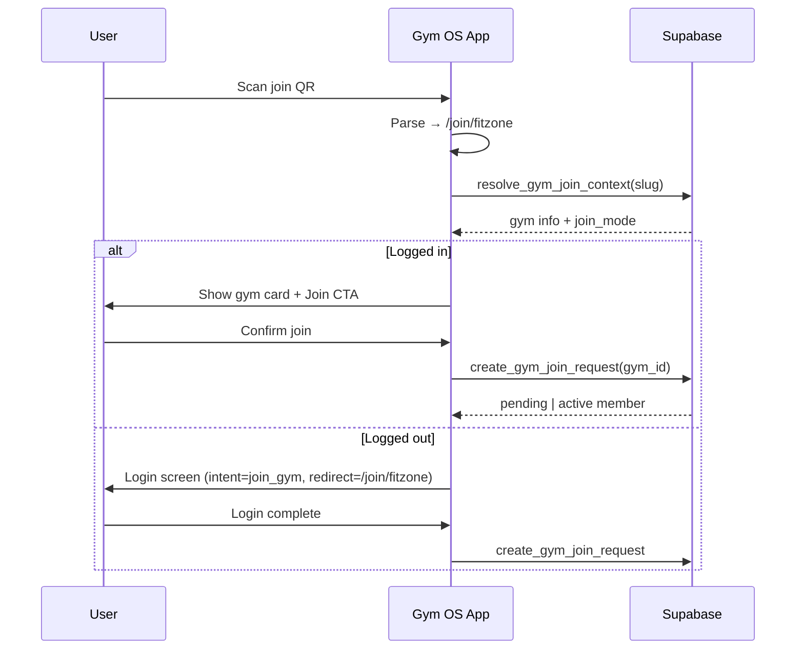
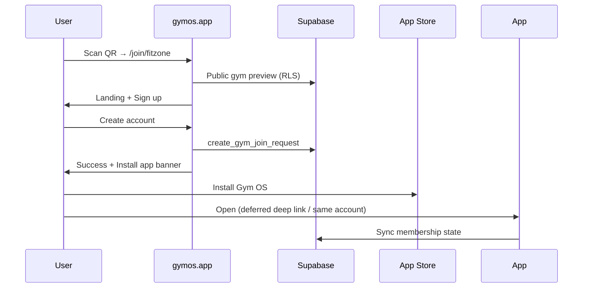
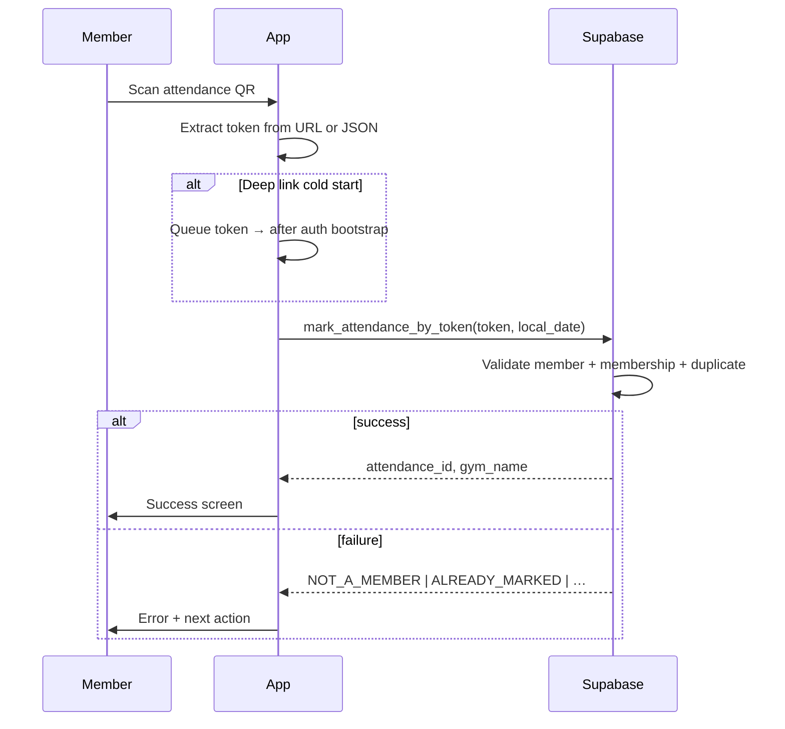
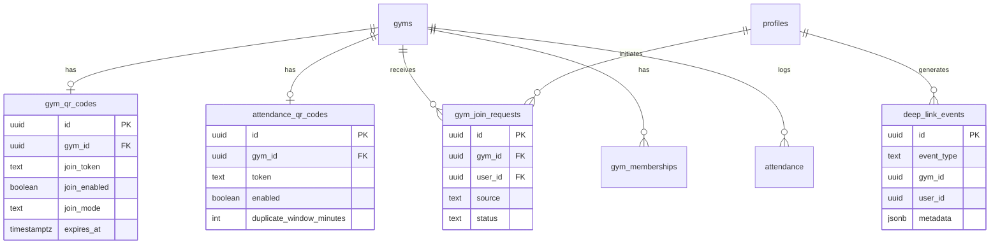

# QR Onboarding & Attendance — System Architecture

Multi-tenant Gym Management SaaS · React Native (Expo) · Web · Supabase

**Current web origin:** [https://gym-management-green.vercel.app](https://gym-management-green.vercel.app)  
Configure via `EXPO_PUBLIC_WEB_APP_ORIGIN` (future custom domain e.g. `gymos.app` uses the same env).

---

## 1. System architecture

```mermaid
flowchart TB
  subgraph entry [Entry Points]
    JQR[Join QR at reception]
    AQR[Attendance QR at gate]
    WEB[https://gymos.app]
    APP[gymos:// deep links]
  end

  subgraph edge [Edge / Routing]
    UL[Universal Links / App Links]
    DL[Deep Link Router]
    WEBAPP[Next.js Website]
  end

  subgraph mobile [Expo Mobile App]
    JOIN[/join/slug]
    SCAN[/attendance-scan]
    AUTH[Auth + Profile]
  end

  subgraph supabase [Supabase]
    RPC[Security Definer RPCs]
    DB[(PostgreSQL + RLS)]
    EDGE[Edge Functions - optional HMAC verify]
  end

  JQR --> UL
  AQR --> UL
  UL -->|app installed| DL
  UL -->|no app| WEBAPP
  WEBAPP -->|Smart App Banner / intent| APP
  DL --> JOIN
  DL --> SCAN
  JOIN --> AUTH
  SCAN --> AUTH
  JOIN --> RPC
  SCAN --> RPC
  RPC --> DB
```

### What exists today

| Area | Status |
|------|--------|
| Attendance token + `mark_attendance_by_token` RPC | ✅ Implemented |
| In-app camera scan (JSON `{v,t}` payload) | ✅ Implemented |
| Owner → member invite (`gym_member_requests`) | ✅ Implemented |
| Join via QR / self-service join | ❌ Missing |
| URL-based QR codes | ❌ Missing |
| Universal links (iOS/Android) | ❌ Missing |
| Next.js marketing site | ❌ Not in repo (Expo web only) |
| Analytics (`deep_link_events`) | ❌ Missing |

### Target state

Two QR products per gym:

1. **Join QR** — public slug in URL, optional signed invite token
2. **Attendance QR** — secret `gat_*` token in URL (never expose raw gym UUID on printed QR)

---

## 2. Deep-link architecture

### URL contract

| Purpose | HTTPS (universal) | Custom scheme | Params |
|---------|-------------------|---------------|--------|
| Join gym | `https://gym-management-green.vercel.app/join/{slug}` | `gymos://join/{slug}` | `?sig=` optional HMAC |
| Attendance | `https://gym-management-green.vercel.app/attendance` | `gymos://attendance` | `?token=gat_…` required |
| Legacy JSON | N/A (in-app scan only) | N/A | `{ "v": 1, "t": "gat_…" }` |

**Note:** Use `gyms.slug` (unique, human-readable), not UUID, in join URLs.  
Example: `https://gymos.app/join/fitzone-indiranagar`

### Resolution flow

```mermaid
flowchart TD
  A[User scans / taps link] --> B{Platform}
  B -->|iOS/Android + app installed| C[Universal Link → gymos handler]
  B -->|No app| D[Next.js / Expo web route]
  C --> E[DeepLinkParser.parse]
  D --> F{Authenticated?}
  F -->|No| G[Auth with redirect + intent]
  F -->|Yes| H[Execute action RPC]
  E --> I{Route kind}
  I -->|join| J[/join/slug screen]
  I -->|attendance| K[/attendance-scan?token=]
  J --> L{Logged in?}
  L -->|No| G
  L -->|Yes| M[Show gym + confirm join]
  K --> N{Logged in?}
  N -->|No| G
  N -->|Yes| O[mark_attendance_by_token]
  D --> P[Smart banner: Install app]
  P --> C
```

### Mobile route map (Expo Router)

| Path | Screen | Auth |
|------|--------|------|
| `/join/[slug]` | Gym join landing | Optional → required on confirm |
| `/attendance-scan` | Scanner or auto-mark | Required |
| `/gym/[id]` | Gym detail (existing) | Optional |

### Website route map (Next.js — planned)

| Path | Purpose |
|------|---------|
| `/join/[slug]` | SEO landing, signup CTA, open-in-app |
| `/attendance` | Redirect to app or “install app” + login |
| `/.well-known/apple-app-site-association` | iOS universal links |
| `/.well-known/assetlinks.json` | Android app links |

### App config requirements

```json
{
  "expo": {
    "scheme": "gymos",
    "ios": {
      "associatedDomains": ["applinks:gymos.app", "applinks:www.gymos.app"]
    },
    "android": {
      "intentFilters": [{
        "action": "VIEW",
        "autoVerify": true,
        "data": [
          { "scheme": "https", "host": "gymos.app", "pathPrefix": "/join" },
          { "scheme": "https", "host": "gymos.app", "pathPrefix": "/attendance" }
        ],
        "category": ["BROWSABLE", "DEFAULT"]
      }]
    }
  }
}
```

Migrate scheme from `gymapp` → `gymos` in a coordinated release (or register both during transition).

---

## 3. Mobile app flows

### Scenario A — Existing user, app installed, join QR



### Scenario B — New user, no app



### Attendance QR — member



---

## 4. Website flows

Until Next.js ships, Expo web can serve `/join/[slug]` with reduced UX (no native scanner).

| User state | Join page behavior |
|------------|-------------------|
| Anonymous | Show gym info → Sign up / Log in → create join request |
| Authenticated | Show confirm join → RPC → memberships tab |
| Already member | Redirect to member dashboard |
| Pending approval | Show “Awaiting owner approval” |
| Gym disabled | 404 / “Gym unavailable” |

**Install prompt:** use `<meta name="apple-itunes-app" content="app-id=…">` and Play Store intent on Android.

---

## 5. Database schema

See migration: `supabase/migrations/20260608120000_qr_join_deep_links.sql`

### Entity overview



### Multi-tenant isolation

- All tenant tables include `gym_id` FK → `gyms.id`
- RLS: members see own rows; owners see gym-scoped rows
- All mutations via **security definer RPCs** with explicit auth checks
- Public read: gym name/logo/slug only (existing `public_read_gyms` pattern)

### Join modes (per gym)

| Mode | Behavior |
|------|----------|
| `instant` | Create `gym_memberships` immediately |
| `approval` | Create `gym_join_requests` → owner approves |
| `invite_only` | Reject QR join (owner invite only) |

---

## 6. API design

### RPCs (Supabase)

| RPC | Caller | Purpose |
|-----|--------|---------|
| `resolve_gym_join_context(p_slug)` | anon + auth | Public gym preview for join landing |
| `create_gym_join_request(p_gym_id, p_source)` | auth | Member-initiated join |
| `owner_respond_join_request(p_request_id, p_decision)` | owner | Approve / reject |
| `owner_upsert_join_qr(p_gym_id, p_regenerate)` | owner | Generate join token |
| `mark_attendance_by_token(p_token, p_local_date)` | auth | ✅ Exists |
| `record_deep_link_event(p_event_type, p_gym_id, p_metadata)` | anon + auth | Analytics |

### REST / Edge (optional)

| Endpoint | Purpose |
|----------|---------|
| `GET /api/join/:slug` | Next.js SSR gym landing |
| `POST /api/join/:slug` | Proxy to RPC (cookie session) |
| `GET /api/attendance/verify?token=` | Pre-flight token validity (no mark) |

### Mobile API modules

- `src/api/join.api.ts` — join context + create request
- `src/api/deep-link-events.api.ts` — fire-and-forget analytics
- `src/api/attendance.api.ts` — ✅ exists

---

## 7. Security strategy

### Threat model

| Threat | Mitigation |
|--------|------------|
| Fake attendance POST | Only `mark_attendance_by_token` RPC; requires auth + active membership |
| URL tampering (join slug) | Slug → gym lookup; no privilege granted until RPC checks |
| Attendance for wrong gym | Token maps to exactly one gym server-side |
| Replay attendance | Unique index `(gym_id, user_id, attendance_date)` + optional cooldown window |
| Scraping join endpoints | Rate limit via Supabase + optional CAPTCHA on web signup |
| Expired invite links | `gym_qr_codes.expires_at` + optional `sig` HMAC with TTL |

### QR payload security

**Attendance (high security):**  
Printed QR contains **unguessable** `gat_<128-bit>` token. URL form:

```
https://gymos.app/attendance?token=gat_abc123…
```

No gym ID in QR → attacker cannot target arbitrary gyms.

**Join (medium security):**  
Slug is public (like a gym’s Instagram handle). Optional signed layer:

```
https://gymos.app/join/fitzone?sig=<hmac>&exp=<unix>
```

HMAC = `HMAC-SHA256(gym_id + exp, JOIN_LINK_SECRET)` verified in Edge Function or RPC.

### RLS principles

- `deep_link_events`: insert-only for authenticated/anon (no PII in metadata)
- `gym_join_requests`: user sees own; owner sees gym’s
- Never expose `attendance_token` / `join_token` via public SELECT on `gyms`

---

## 8. QR generation strategy

### Join QR (reception poster)

```
Content: https://gymos.app/join/{slug}
Fallback human text: "Scan to join {Gym Name} on Gym OS"
Size: 300×300 mm print → QR version 5+, error correction H
```

Generate in owner dashboard via `react-native-qrcode-svg` (same as attendance).

### Attendance QR (check-in desk)

Support **dual encoding** during migration:

1. **URL (preferred for deep links):** `https://gymos.app/attendance?token={gat_token}`
2. **JSON (legacy in-app):** `{"v":1,"t":"gat_…"}`

Parser accepts both (see `src/lib/deep-links/parse.ts`).

### Regeneration policy

| QR type | When to regenerate |
|---------|-------------------|
| Join | Rarely; slug change only |
| Attendance | On compromise suspicion or owner action |

---

## 9. UX matrix

| Persona | Join QR | Attendance QR |
|---------|---------|---------------|
| New user, no app | Web landing → signup → install prompt | Web → login → install → scan again |
| App installed, logged out | Login → join confirm | Login → auto-mark |
| Member, logged in | Join confirm or “Already a member” | Instant mark + success |
| Pending join approval | “Waiting for owner” state | Block with message |
| Non-member | Join flow | `NOT_A_MEMBER` error |
| Expired membership | Join / renew CTA | `MEMBERSHIP_EXPIRED` |
| Gym disabled | “Gym unavailable” | `GYM_INACTIVE` |
| Invalid QR | Generic error + support | `INVALID_QR` |
| Duplicate attendance | N/A | `ALREADY_MARKED` + today’s time |

---

## 10. Analytics

### Events (`deep_link_events.event_type`)

| Event | When |
|-------|------|
| `qr_scan_join` | Join link opened |
| `qr_scan_attendance` | Attendance link opened |
| `join_conversion` | Join request created |
| `join_approved` | Owner approved |
| `attendance_success` | RPC success |
| `attendance_failed` | RPC error code |
| `install_prompt_shown` | Web banner displayed |
| `install_conversion` | Deferred deep link matched |

### Dashboards (future)

- Funnel: scan → auth → join → active member
- Per-gym attendance scan success rate
- Failed attendance reasons breakdown

---

## 11. Production implementation plan

### Phase 1 — Foundation (Week 1) ✅ started

- [x] Architecture doc
- [x] DB migration (`gym_qr_codes`, `gym_join_requests`, `deep_link_events`, RPCs)
- [x] Deep link parser + mobile routes `/join/[slug]`
- [x] Extend attendance parser for URL tokens
- [x] Deep link bootstrap hook

### Phase 2 — Mobile UX (Week 2)

- [ ] Join landing screen with gym preview + confirm
- [ ] Owner: generate Join QR in dashboard
- [ ] Update attendance QR to URL format
- [ ] Cold-start deep link queue (attendance token after login)
- [ ] Notification taps → join request / attendance

### Phase 3 — Universal links (Week 3)

- [ ] Register `gymos.app` domain
- [ ] AASA + assetlinks.json
- [ ] Update `app.json` scheme + associated domains
- [ ] EAS build + device testing

### Phase 4 — Next.js website (Week 4–5)

- [ ] Scaffold Next.js on `gymos.app`
- [ ] `/join/[slug]` SSR landing
- [ ] Shared Supabase auth (cookies)
- [ ] Smart app banner + Play/App Store links
- [ ] Deferred deep linking (Branch.io optional)

### Phase 5 — Scale & harden (Week 6+)

- [ ] Rate limiting on RPCs
- [ ] HMAC signed join links for campaigns
- [ ] Configurable attendance cooldown per gym
- [ ] Owner analytics dashboard for QR funnels
- [ ] Load test `mark_attendance_by_token` at 10k gyms

---

## 12. File index (this implementation)

| File | Purpose |
|------|---------|
| `docs/QR_ONBOARDING_ATTENDANCE_ARCHITECTURE.md` | This document |
| `supabase/migrations/20260608120000_qr_join_deep_links.sql` | Schema + RPCs |
| `src/lib/deep-links/` | Parse, route, constants |
| `src/hooks/useDeepLinkHandler.ts` | Cold/warm link handling |
| `src/api/join.api.ts` | Join RPC client |
| `app/join/[slug].tsx` | Join deep link route |
| `app/attendance-scan.tsx` | Extended with `?token=` param |
